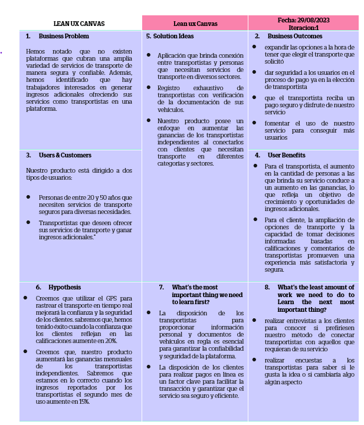

# 
## Startup Profile
### Descripción de la Start-up
Somos un grupo de estudiantes de la Universidad Peruana de Ciencias Aplicadas que ha identificado una oportunidad de negocio en el sector del transporte, que abarca una variedad de áreas. Hemos notado que obtener servicios de transporte de carga o movilidad personal no es tan simple como buscar un producto en línea. Ya sea que necesites transportar mercancías o llevar a tu familia de paseo, a menudo es complicado encontrar proveedores confiables.
Además, somos conscientes de que existen muchos transportistas independientes que ofrecen servicios de movilidad o transporte de carga, pero a menudo tienen dificultades para llegar a un público más amplio que su propia red de contactos.
Por lo tanto, hemos creado FastPorte, una plataforma que conectará a transportistas de diferentes sectores, ya sean independientes o empresas, con personas que necesitan sus servicios. El proceso será sencillo: los transportistas se registrarán proporcionando sus datos personales y completando sus perfiles, esperando a que los clientes los contacten. Por otro lado, las personas que requieran transporte se registrarán, buscarán transportistas en el sector que necesiten y podrán ver las reseñas de clientes anteriores para tomar una decisión informada. Una vez que elijan un transportista, deberá completar un formulario con los detalles del viaje y realizar el pago del servicio. Finalmente, el transportista se dirigirá al lugar acordado, completará el trabajo y nosotros le pagaremos por el servicio prestado."
## Misión: 
“Simplificar, garantizar y mejorar la seguridad en la búsqueda de servicios de transporte en cualquier sector para todos los usuarios”. 
## Visión: 
“Posicionarnos como la opción principal de búsqueda de servicios de transporte para los ciudadanos peruanos, superando constantemente las expectativas de cada cliente". 

# Perfiles de integrantes del equipo

#Solution Profile
Nuestra propuesta como equipo es "Tech Company", una aplicación diseñada para facilitar la conexión entre transportistas y personas que necesiten sus servicios. Este proceso se realizará de manera fácil, accesible y segura tanto para los clientes como para los transportistas. 
## Antecedentes y Problemática 
### Antecedentes:
Con respecto a nuestra propuesta, nuestra competencia es la siguiente:
- TuRuta: Una aplicación móvil desarrollada en Perú que brinda a los usuarios del transporte público en Lima la capacidad de descubrir la ruta óptima para su viaje interurbano y conocer las opciones de transporte disponibles.

- MiCarGapp: App peruana que establece conexiones entre usuarios y clientes que necesitan enviar cargas que pesan desde una tonelada a cualquier ciudad del país, facilitando el transporte de una amplia gama de mercancías, desde mudanzas hasta líquidos peligrosos.

- MuberZ: Es una aplicación diseñada para mudanzas de pequeña escala o el transporte de artículos específicos, como electrodomésticos, en Lima. Los servicios ofrecidos pueden variar, desde el simple traslado hasta incluir el embalaje y desembalaje de los artículos.

### The 5W´s y 2 H´s:
- What? (¿Qué?)
En la actualidad, existen varias aplicaciones que ofrecen servicios de transporte, pero la mayoría de ellas se centran en entornos urbanos, como Uber, Didi, Cabify, y otras. Nuestra propuesta es mucho más amplia y global. Queremos abarcar desde servicios de transporte personalizados para paseos familiares de hasta 15 personas, hasta servicios que requieran transportar toneladas de carga. Con esta visión integral, buscamos simplificar la conexión entre transportistas y clientes, brindando una solución que satisfaga las necesidades de ambos de manera efectiva y eficiente.

- When? (¿Cuándo?)
El problema surge cuando alguien necesita encontrar un medio de transporte específico para un propósito particular. En muchas ocasiones, solo encontramos servicios de taxis a través de diversas aplicaciones. Sin embargo, nos enfrentamos a la incertidumbre de dónde buscar cuando necesitamos un transporte más grande o con mayor capacidad, ya sea para transportar a un grupo de personas o una cantidad significativa de carga de cualquier tipo.

- Where? (¿Dónde?)
Nuestro servicio se dará a nivel nacional en un futuro, sin embargo, por ahora, y para comenzar, nos consolidaremos en la capital y luego iremos creciendo hacia otras regiones para cumplir con nuestra visión como startup.

- Who? (¿Quién?)
FastPorte está dirigida a todas las personas que deseen encontrar de manera más rápida y confiable un servicio de transporte que abarca cualquier rubro según la disponibilidad. Por otra parte, también está dirigido a todos los transportistas a todos los transportistas que requieran brindar este servicio ampliar su oferta a más personas y tener más ingresos.

- Why? (¿Por qué?)
Como mencionamos anteriormente, esta propuesta surge como respuesta a la necesidad de contar con una plataforma que permita a transportistas particulares de todos los sectores ofrecer sus servicios, brindando a las personas o clientes una variedad de opciones para elegir el tipo de servicio que necesitan. Además, se crea este espacio para que aquellos trabajadores que se dedican al transporte, ya sea de carga, mercancías, personas, u otros, de manera independiente, puedan ampliar su alcance de público y, como resultado, aumentar sus ganancias.

- How? (¿Cómo?)
Las personas y transportistas interesados en utilizar nuestros servicios podrán encontrarnos en línea a través de nuestro sitio web, donde encontrarán información relevante en nuestra landing page, o bien, podrán descargar nuestra aplicación móvil. Otra opción para ubicarnos es a través de las redes sociales del startup, y también podrán descargar la aplicación desde Google Play o la App Store.

- How much? (¿Cuánto?)
En Perú, nuestra competencia directa es limitada, ya que la mayoría de las aplicaciones de transporte se centran exclusivamente en mudanzas o en el transporte de carga pesada que supere una tonelada. En consecuencia, nos posicionamos como el único startup que ofrece un enfoque integral, a incluir todo tipo de transportes, desde la solicitud de una minivan para fines familiares hasta la contratación de transporte de carga pesada para mercancías.

## Lean UX Process
### Lean UX Problem Statement
El servicio de transporte es esencial tanto para los clientes que necesitan trasladar mercancías o productos, como para las personas que requieren movilidad para diversos fines, como paseos familiares o viajes escolares. Hemos notado que existen plataformas que ofrecen información sobre servicios de transporte, pero a menudo se limitan a un sector específico y no cubren todas las necesidades (como movilidad y carga). Además, no siempre podemos confiar en la veracidad y seguridad de la información proporcionada. 
¿cómo podemos reunir todos los sectores de transporte en un solo lugar donde las personas puedan adquirir servicios de manera segura?

Los trabajadores del sector transporte desempeñan un papel fundamental en diferentes negocios, emprendimientos y para los clientes en general. Sin embargo, sabemos que muchos de ellos tienen empleos eventuales e independientes en los que trabajan como transportistas de carga, conductores de movilidad, prestadores de servicios de mudanza, entre otros. Hemos notado que no existe un lugar confiable donde este grupo de trabajadores pueda ofrecer sus servicios y productos, lo que les permitiría generar ingresos adicionales o ampliar su base de clientes y redes de contactos.
¿Cómo podemos lograr que este sector pueda ofrecer sus servicios a un público más amplio para obtener ingresos adicionales de manera sencilla?

## Lean UX Assumptions
 ### CARACTERISTICAS:
- Registro de usuarios, con identificación adecuada para transportistas y clientes.
- Perfiles de transportistas con información relevante, fotos de vehículos y documentos de seguridad.
- Sistema de calificación por estrellas y comentarios de clientes anteriores para evaluar la reputación de los transportistas.
- Opción de pago en línea para los servicios (el pago se realizará al transportista una vez completado el trabajo).
- Historial de servicios brindados (para transportistas) y servicios contratados (para clientes).
- Foro comunitario para construir una comunidad en la plataforma.
- Seguimiento en tiempo real de la ubicación del transporte utilizando tecnología GPS.
- Filtros para que los clientes puedan elegir el tipo de transporte que necesitan.
### BUSINESS OUTCOMES:
- Ampliar las opciones disponibles para que los usuarios tengan una variedad de opciones de transporte para elegir.
- Garantizar la seguridad de los usuarios durante el proceso de pago y al seleccionar un transportista.
- Asegurar que los transportistas reciban pagos de manera segura y disfruten de nuestros servicios.
- Promover el uso continuo de nuestra plataforma para atraer a más usuarios y aumentar nuestra base de clientes.
### BENEFICIOS DEL USUARIO:
- Para los transportistas, nuestro objetivo es ayudarlos a expandir su base de clientes y, en consecuencia, aumentar sus ingresos.
- Para los clientes, buscamos proporcionarles una mayor variedad de opciones de transporte y la capacidad de tomar decisiones informadas basadas en las calificaciones y comentarios de los transportistas.
- Para los clientes, queremos simplificar la búsqueda de servicios de transporte para los clientes al ofrecer una plataforma única y centralizada en lugar de tener que buscar en varios sitios web.
- Para los clientes, les permitimos mantenernos informados sobre la ubicación de su transporte a través de la tecnología GPS.
- Les brindamos la oportunidad de compartir sus experiencias y opiniones en un foro comunitario.
### BUSINESS ASSUMPTIONS
- Creemos que los usuarios buscan un espacio seguro donde tanto los transportistas como los clientes puedan ofrecer y adquirir servicios de transporte de manera confiable.
- Los transportistas desean una plataforma que les permita llegar a un público más amplio y aumentar sus ingresos al proporcionar sus servicios.
- Nuestros usuarios valoran la veracidad de la información y la seguridad en los pagos al buscar y adquirir servicios de transporte. Estas necesidades pueden abordarse mediante una aplicación que conecta a transportistas y clientes, garantizando la seguridad y la satisfacción del usuario.
- Los usuarios iniciales serán transportistas que ofrecen servicios de transporte en diversos rubros.
- El valor número uno que una persona busca en la aplicación es la rapidez, confiabilidad y seguridad al contratar servicios de transporte.
- Planeamos atraer clientes a través de anuncios cuando busquen servicios de transporte en línea o cuando los transportistas busquen clientes en sitios web relevantes.
- Nuestros ingresos provendrán de publicidad no intrusiva dentro de la aplicación y de comisiones por los pagos de servicios.
- Nuestra competencia principal en el mercado son startups relacionadas con el transporte, pero diferenciamos al abarcar diversos sectores de transporte ya través de una estrategia publicitaria efectiva en sitios web clave.
- El mayor riesgo para la aplicación es la información errónea o falsa sobre los transportistas, lo cual podría causar problemas con los clientes durante la prestación del servicio. 
- Venceremos, mejoraremos la gestión y verificación de la información, y solicitaremos pruebas de la información proporcionadas por los transportistas.
### USER ASSUMPTIONS
- ¿Quién es el usuario?  
Nuestro producto está dirigido tanto a personas que brindan servicios de transporte relacionados con diversos sectores como a personas de entre 20 y 50 años que requieran de estos servicios.

- ¿Dónde encaja nuestro producto en su trabajo o vida? 
Para los transportistas, nuestro producto encaja en su trabajo al permitirles ofrecer sus servicios de manera más amplia. Para los clientes, encaja en su vida cotidiana al proporcionarles una solución conveniente para sus necesidades de transporte.

- ¿Qué problemas tiene nuestro producto y cómo se pueden resolver? 
Uno de los posibles problemas podría ser la experiencia del usuario debido a la variedad de opciones disponibles. Esto se puede abordar recopilando comentarios de la comunidad y optimizando las características de la aplicación para que sea más fácil de usar y más eficiente.

- ¿Cuándo y cómo se usa nuestro producto? 
Nuestro producto será de fácil acceso y uso, y se utilizará cada vez que un cliente necesite un servicio de transporte en cualquier contexto donde haya un transportista registrado que ofrezca dicho servicio.

- ¿Qué características son importantes? 
La usabilidad y la claridad de los llamados a la acción son esenciales. La plataforma debe ser útil tanto para los transportistas como para los clientes, ofreciendo una experiencia intuitiva y efectiva.

- ¿Cómo debe verse nuestro producto y cómo debe comportarse?
La interfaz debe ser amigable y sencilla, con una elección adecuada de colores que transmitan confianza y seguridad. El diseño debe reflejar seriedad y profesionalismo, para generar confianza en los usuarios.

## Lean UX Hyphotesis Statements
### Hypothesis #1
Creemos que, utilizar el GPS para rastrear el transporte en tiempo real mejorará la confianza y la seguridad de los clientes. Sabremos que, hemos tenido éxito cuando la confianza que los clientes reflejan en las calificaciones aumente en 20%.
### Hypothesis #2
Creemos que, nuestra app perdurará en el mercado. Sabremos que, es cierto cuando los usuarios sigan evaluando y calificando el funcionamiento de la app. 

### Hypothesis #3
Creemos que, tener anuncios en internet aumentará el número de nuevos usuarios. Sabremos que, es cierto cuando notemos un incremento mensual del 10% de nuevos usuarios.

### Hypothesis #4
Creemos que, nuestro producto aumentará las ganancias mensuales de los transportistas independientes. Sabremos que, estamos en lo correcto cuando los ingresos reportados por los transportistas el segundo mes de uso aumente en 15%.

### Hypothesis #5
Creemos que, ver la reputación de los transportistas aumentará los contratos de aquellos que tienen mejor calificación. Sabremos que, es cierto cuando los ingresos de aquel grupo destacado aumenten en 35%.

## Lean UX Canvas

Capítulo II: Requirements Elicitation & Analysis

## Competidores

**Competitive Analysis Landscape**

### Estrategias y tacticas frente a competidores

**Liderazgo en costes**

Las personas buscan precios comodos, por esta razon nuestra plataforma permite visualizar las mejores ofertas deacuerdo a su presupuesto.

**Estrategias de diferenciacion**

Nuestra aplicacion ofrece una idea innovadora de ofrecer diversos servicios de movilidad haciendo que tengamos un amplio catalogo de servicios.

**Estrategia de enfoque**

Actualmente las personas utilizan mucho la tecnologia para poder ofrecer informacion sobre algo que les interese. Por esta razon, se decidio crear una apliacion para que en una sola plataforma puedan obtener todos los servicios de movilidad que las personas necesiten.

**Tactica de expansion**

Si la aplicacion logra tener mucho exito, se planea ofrecer un servicio directo de la empresa a los clientes , dando un servicio mas seguro y confiable.

## Entrevistas

### Diseño de entrevistas

Preguntas al segmento cliente:

- ¿Cual es tu nombre, que edad tienes y a que te dedicas?

- ¿Que opinas de los servicios de transporte de mercaderia en el Peru?

- ¿Alguna vez contactaste con un servicio de traslado de productos? ¿Por que medio obtuviste el contacto?

- ¿Que tan complicado se te hace encontrar de traslado de productos?

- ¿Que tan complicado se te hace encontrar un servicio de traslado de productos?

- ¿Que tan importante consideras el estar pendiente de la ubicacion de tu producto en tiempo real?

- ¿A quien recurres cuando necesitas el servicio de traslado de tus productos?

- ¿Que tan importante consideras el estar pendiente de la ubicacion de tu producto en tiempo real?

- ¿Considera importante conocer el modelo y el año del vehiculo que va a trasladar su producto?

- ¿Que opina acerca de una aplicacion que te facilite encontrar un servicio de traslado de productos?

- ¿Estaria dispuesto a probarla? ¿Por que?

- ¿Que cree que  podria mejorar o añadir a nuestra propuesta?

### Registro de entrevistas

### Analisis de entrevistas

## Needfinding

### User Personas

User Persona Manuel Segura, usuario cliente

User Persona Mario Gomez, usuario transportista

### User Task Matrix

User Task Matrix del usuario cliente

| Tareas                                                        | Frecuencia    | Importancia |
| ------------------------------------------------------------- | ------------- | ----------- |
| Contactar con un transportistas para hacer uso de transporte  | Siempre       | Alta        |
| Saber cual sera el precio por el transporte                   | Siempre       | Alta        |
| Conocer los tipos de transporte que ofrecer el transportista  | Siempre       | Alta        |
| Hacer un seguimiento del producto                             | Casi siempre  | Alta        |
| Mostrar los transportistas para brindarle opciones al usuario | Casi siempre  | Media       |
| Brindar una reseña del servicio                               | Algunas veces | Media       |
| Recomendar el servicio proporcionado                          | Casi nunca    | Baja        |
| Contactar con el cliente                                      | A menudo      | Alta        |
| Acordar cual sera el producto por llevar  y el tamaño         | A menudo      | Alta        |
| Acordar el precio con el cliente                              | Siempre       | Alta        |
| Establecer el dia de llegada del producto                     | Siempre       | Alta        |
| Pactar cual sera el lugar de destino                          | Siempre       | Alta        |
| Transportar el producto                                       | Siempre       | Alta        |
| Evidenciar que el producto ha sido entregado con exito        | A menudo      | Media       |
| Cobrar por el servicio                                        | Siempre       | Alta        |

### User Journey Mapping

[Customer journey map Cliente.png - Google Drive](https://drive.google.com/file/d/1DelRJHx-PkUYMqBJS3kn_UyRooJebH82/view?usp=sharing)

User Journey Mapping del usuario Cliente

[Customer journey map Transportista.png - Google Drive](https://drive.google.com/file/d/195237stsxd5KRQodgBIrRZVIegOIYVhi/view?usp=sharing)

User Journey Mapping del usuario transportista

### Empathy Mapping

Empathy Mapping del usuario cliente

Empathy Mapping del usuario transportistas

### As-is Scenario Mapping

As-is Scenario Mapping del usuario cliente

As-is Scenario Mapping del usuario transportistas

