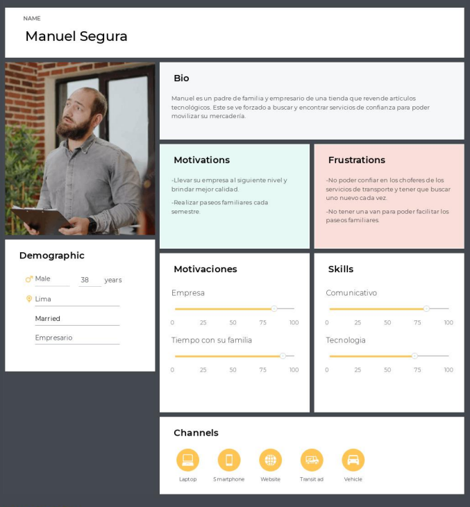
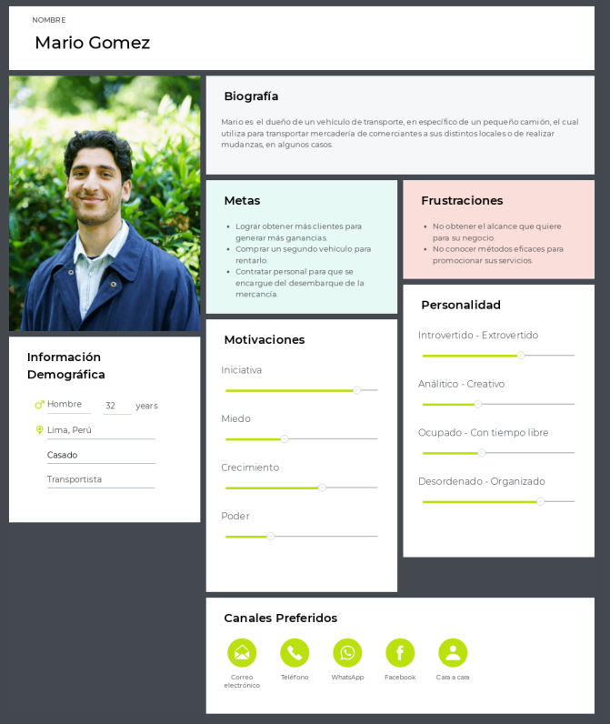
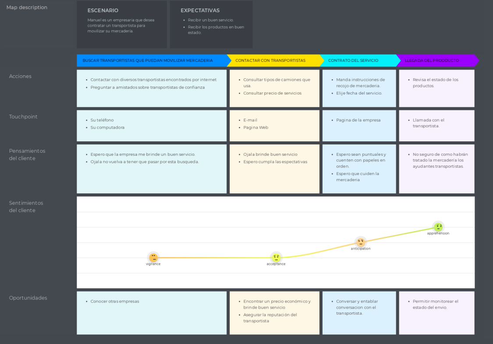
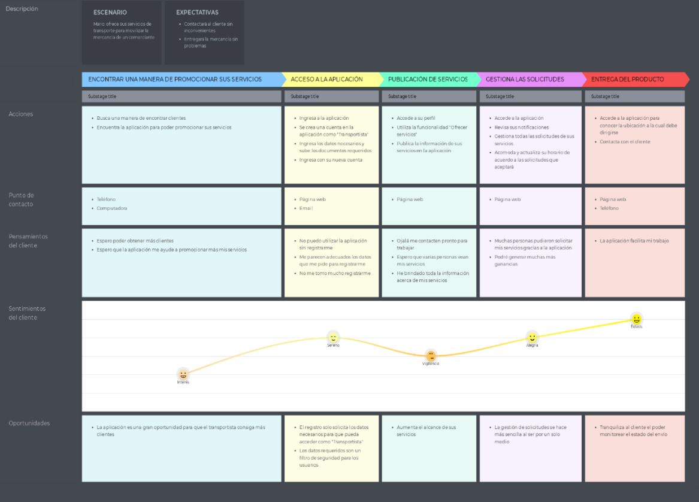
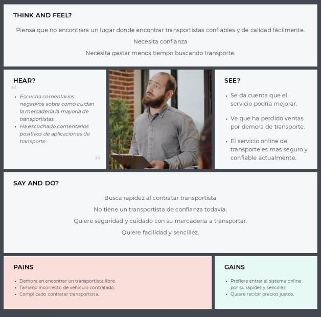
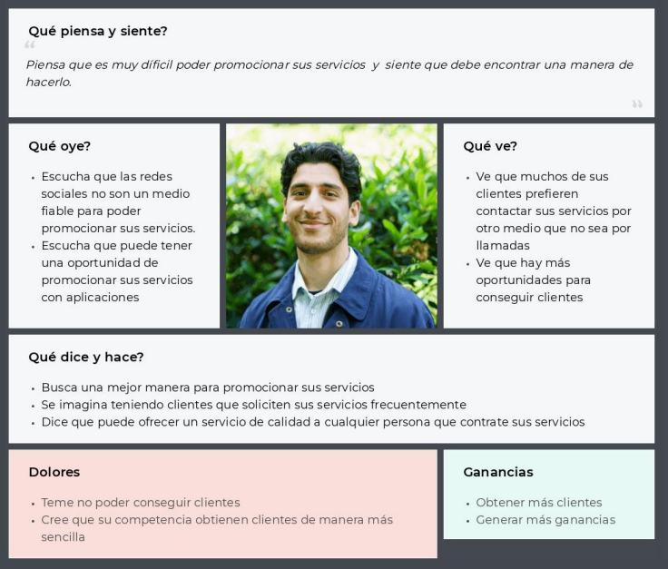
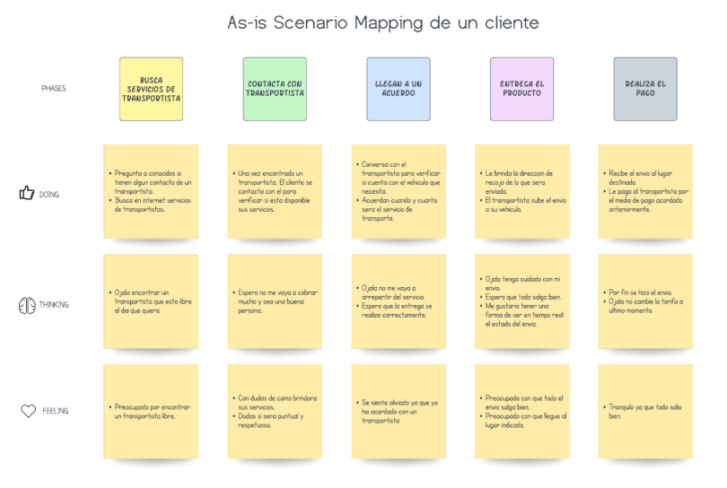
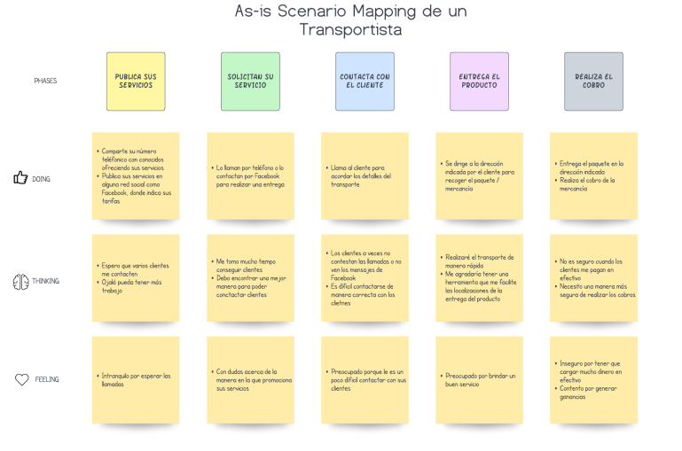

STUDENT OUTCOME

A. Criterio específico 1: Comunica oralmente sus ideas y/o resultados con objetividad a público de diferentes especialidades y niveles jerárquicos, en el marco del desarrollo de un proyecto en ingeniería.

  TB1

>> Bernuy Villanueva, Caroline Denisse: Para esta entrega se realizaron entrevistas para los usuarios con rol "trasportista" para determinar y mejorar las features. Se organizó con el grupo para el cumplimiento de fechas límites. 	Se realizó el PPT Keynote completo con la nueva información. Se modificó y mejoró la sección Style Guidelines, Landing Page UI Design, Web Application UX/UI Design, Web Applications Prototyping y Software Object-Oriented Design.

B. Criterio específico 2: Comunica en forma escrita ideas y/o resultados con objetividad a público de diferentes especialidades y niveles jerarquicos, en el marco del desarrollo de un proyecto en ingeniería.

  TB1

>> Bernuy Villanueva, Caroline Denisse: Se realizaron entrevistas y análisis de cada respuesta para evaluar la consistencia del diseño y las funcionalidades de la aplicación.
Se creó y modificó la Landing Page.

#

1.1.2.	Perfiles de integrantes del equipo

INTEGRANTE 1: 
Mi nombre es Caroline Denisse Bernuy Villanueva, estudiante de la carrera de ingeniería de software. Tengo conocimientos previos en desarrollo web con frameworks como Vue, Angular, Express JS y Laravel. Diseño de base de datos SQL y creación de APIs. Mi perfil profesional está orientado al desarrollo de soluciones cloud.

INTEGRANTE 2: 
INTEGRANTE 3: 
INTEGRANTE 4: 
INTEGRANTE 5: 

#

Capítulo II: Requirements Elicitation & Analysis

## Competidores

**Competitive Analysis Landscape***

### Estrategias y tacticas frente a competidores

**Liderazgo en costes**

Las personas buscan precios comodos, por esta razon nuestra plataforma permite visualizar las mejores ofertas deacuerdo a su presupuesto.

**Estrategias de diferenciacion**

Nuestra aplicacion ofrece una idea innovadora de ofrecer diversos servicios de movilidad haciendo que tengamos un amplio catalogo de servicios.

**Estrategia de enfoque**

Actualmente las personas utilizan mucho la tecnologia para poder ofrecer informacion sobre algo que les interese. Por esta razon, se decidio crear una apliacion para que en una sola plataforma puedan obtener todos los servicios de movilidad que las personas necesiten.

**Tactica de expansion**

Si la aplicacion logra tener mucho exito, se planea ofrecer un servicio directo de la empresa a los clientes , dando un servicio mas seguro y confiable.

## Entrevistas

### Diseño de entrevistas

Preguntas al segmento cliente:

- ¿Cual es tu nombre, que edad tienes y a que te dedicas?

- ¿Que opinas de los servicios de transporte de mercaderia en el Peru?

- ¿Alguna vez contactaste con un servicio de traslado de productos? ¿Por que medio obtuviste el contacto?

- ¿Que tan complicado se te hace encontrar de traslado de productos?

- ¿Que tan complicado se te hace encontrar un servicio de traslado de productos?

- ¿Que tan importante consideras el estar pendiente de la ubicacion de tu producto en tiempo real?

- ¿A quien recurres cuando necesitas el servicio de traslado de tus productos?

- ¿Que tan importante consideras el estar pendiente de la ubicacion de tu producto en tiempo real?

- ¿Considera importante conocer el modelo y el año del vehiculo que va a trasladar su producto?

- ¿Que opina acerca de una aplicacion que te facilite encontrar un servicio de traslado de productos?

- ¿Estaria dispuesto a probarla? ¿Por que?

- ¿Que cree que  podria mejorar o añadir a nuestra propuesta?

### Registro de entrevistas

Clientes:
a.	Primera entrevista: 
o	Entrevistado: 
o	Edad:
o	Residencia: 
o	Ocupación: 
o	Entrevistador: 
o	Enlace: 

--Resumen/Transcripción

Transportistas:

a.	Primera entrevista:

o	Entrevistado: Joakim Francia Murga 
o	Edad: 20 años
o	Residencia: Jesús María
o	Ocupación: Estudiante
o	Entrevistador: Caroline Bernuy
o	Enlace: https://youtu.be/IiZXr7LSXY0

Joakim Francia indica que trabaja en una empresa familiar de transporte de carga pesada. Su experiencia en el rubro es basta ya que la empresa ya tiene al menos 3 generaciones creciendo. Los problemas más comunes son el seguimiento de las cargas y organización de rutas largas puesto a que los choféres no tiene cómo afrontar situaciones adversas cuando están llevando las cargas y dependen estrictamente del su seguro para solucionar problemas mecánicos. Por un lado, el tiempo puede ser optimizado con una mejor organización y optimización del espacio de carga. Por otro lado, la opción de poder notificar inconvenientes directamente al cliente en tiempo real le sería muy útil.

### Analisis de entrevistas

## Needfinding

### User Personas

User Persona Manuel Segura, usuario cliente

User Persona Mario Gomez, usuario transportista

### User Task Matrix

User Task Matrix del usuario cliente

| Tareas                                                        | Frecuencia    | Importancia |
| ------------------------------------------------------------- | ------------- | ----------- |
| Contactar con un transportistas para hacer uso de transporte  | Siempre       | Alta        |
| Saber cual sera el precio por el transporte                   | Siempre       | Alta        |
| Conocer los tipos de transporte que ofrecer el transportista  | Siempre       | Alta        |
| Hacer un seguimiento del producto                             | Casi siempre  | Alta        |
| Mostrar los transportistas para brindarle opciones al usuario | Casi siempre  | Media       |
| Brindar una reseña del servicio                               | Algunas veces | Media       |
| Recomendar el servicio proporcionado                          | Casi nunca    | Baja        |
| Contactar con el cliente                                      | A menudo      | Alta        |
| Acordar cual sera el producto por llevar  y el tamaño         | A menudo      | Alta        |
| Acordar el precio con el cliente                              | Siempre       | Alta        |
| Establecer el dia de llegada del producto                     | Siempre       | Alta        |
| Pactar cual sera el lugar de destino                          | Siempre       | Alta        |
| Transportar el producto                                       | Siempre       | Alta        |
| Evidenciar que el producto ha sido entregado con exito        | A menudo      | Media       |
| Cobrar por el servicio                                        | Siempre       | Alta        |

### User Journey Mapping

[Customer journey map Cliente.png - Google Drive](https://drive.google.com/file/d/1DelRJHx-PkUYMqBJS3kn_UyRooJebH82/view?usp=sharing)

User Journey Mapping del usuario Cliente

[Customer journey map Transportista.png - Google Drive](https://drive.google.com/file/d/195237stsxd5KRQodgBIrRZVIegOIYVhi/view?usp=sharing)

User Journey Mapping del usuario transportista

### Empathy Mapping

Empathy Mapping del usuario cliente

Empathy Mapping del usuario transportistas

### As-is Scenario Mapping

As-is Scenario Mapping del usuario cliente

As-is Scenario Mapping del usuario transportistas

#

CAPÍTULO 4: PRODUCT UX/UI DESIGN

4.1. Style Guidelines.
En esta sección presentaremos las guías de estilo que usaremos para la realización de nuestros mock-ups, prototipo y aplicación web. 

4.1.1 General Style Guidelines.
El estilo general de nuestro product UX/UI design contiene los siguientes colores los cuales se especifican con su código. Así como también la fuente utilizada es Inter.
Figura 12
Colores del General Style Guidelines 

Figura 13
Tipo de fuente del General Style Guidelines

4.1.2. Web Style Guidelines.

Lo siguiente corresponde a la guía de estilos para la versión web. Se puede visualizar con mejor detalle en el siguiente link: https://www.figma.com/file/ipzddVXEuU5ee0IHE0hLyv/Open-source?node-id=50%3A2 

Figura 14
Tipografía utilizada en el General Style Guidelines

Figura 15
Search Interactive Elements del General Style Guidelines

Figura 16
Input Interactive Elements del General Style Guidelines

Figura 17
Buttons Interactive Elements del General Style Guidelines

Figura 18
Buttons & Slider Interactive Elements del General Style Guidelines

Figura 19
Form Elements del General Style Guidelines

4.2. Information Architecture.
En esta sección, mostramos el Information Architecture de FastPorte, donde se plantea la organización y estructura que se manejara para esta propuesta. Teniendo en cuenta, que nuestros usuarios puedan saber dónde se encuentra la información que se está buscando.
Organization Systems.
Enlace al diagrama: https://overflow.io/s/0OYSZACI

Figura 20

4.2.1. Organizations Systems de FastPorte 

4.2.2. Labeling Systems.
Para los sistemas de etiquetado, utilizamos el lenguaje formal que refleja la seriedad en la aplicación, buscando así la mejor experiencia para nuestros usuarios.
Label transportista:

Figura 21
Labeling Systems del transportista de FastPorte

Label cliente:
Figura 22
Labeling Systems del cliente de FastPorte

 
Transportista:
Sección “Home”
En esta sección podremos encontrar accesos rápidos que creemos que el usuario podría necesitar, tales como “Recent Contrats” o acceder el historial de contratos pasados

Sección “My Profile”
En este apartado el usuario puede visualizar su perfil como transportista y evidenciar características que le harán llamar la atención de los clientes como una buena opción para contratarlo.

Sección “Contracts” 
Dentro de esta sección podrán ver el historial de los contratos y los contratos que todavía siguen pendientes.

Sección “Support” 
Al hacer click en este apartado el usuario podrá visualizar información de contacto como correo, número y una opción para enviar mensajes directos con el soporte de la aplicación.
Sección “Notification” 
Dentro de esta sección el usuario podrá visualizar los mensajes, solicitudes, contratos y todo tipo de notificaciones entrantes.

Cliente:
Sección “Home”
En esta sección podremos encontrar accesos rápidos que creemos que el usuario podría necesitar, tales como “Recent Contrats”o buscar un vehículo directamente.

Sección “My Profile” 
En este apartado el usuario puede visualizar su perfil como cliente y evidenciar características que le servirán a los transportistas para tener en cuenta a sus clientes.

Sección “Search Vehicles” 
Dentro de esta sección el usuario podrá ingresar los datos de los requerimientos para el servicio que desea solicitar. Y así el sistema le pueda recomendar el mas adecuado a sus intereses.

Sección “Contracts” 
Dentro de esta sección podrán ver el historial de los contratos y los contratos que todavía siguen pendientes.

Sección “Support” 
Al hacer click en este apartado el usuario podrá visualizar información de contacto como correo, número y una opción para enviar mensajes directos con el soporte de la aplicación.

Sección “Notification” 
Dentro de esta sección el usuario podrá visualizar los mensajes, solicitudes, contratos y todo tipo de notificaciones entrantes.

4.2.3. SEO Tags and Meta Tags
Figura 23
SEO Tags and Meta Tags de FastPorte

Charset Tag	
Utilizamos charset UTF-8 o Unicode Transformation Format-8, el cual es el formato de codificación de caracteres mundialmente usado por su amplia cantidad de idiomas soportados.

Viewport Tag
Debido a que no todos los dispositivos cuentan con las mismas dimensiones; nos debemos asegurar de que nuestra página funcione correctamente en todos los tamaños y orientaciones de pantalla.
Width: Controla el tamaño de la ventana gráfica. Se puede configurar en un número específico de píxeles como ancho = 600 o en el valor especial ancho del dispositivo, que es 100vw, o el 100% del ancho de la ventana gráfica. 
Initial-scale: Controla el nivel de zoom cuando la página se carga por primera vez. Mínimo: 0,1. Máximo: 10. Predeterminado: 1. Valores negativos: ignorados.
Translate: Para ofrecer la traducción de la página en los resultados de búsqueda.
Snippet: Para que muestre el título y la descripción en los resultados de búsqueda.

Description Tag
Esta etiqueta se usa para proporcionar una descripción breve de la página. En algunos casos, esta descripción se usa en el fragmento que se muestra en los resultados de la búsqueda.

Robots Tag
Nos sirven para controlar el comportamiento de rastreo y de indexación en los motores de búsqueda.
Index: Sirve para indicarle al motor de búsqueda si deseamos ser indexados para que aparezca la página en los resultados de búsqueda.
No-follow: Indica para no rastrear los links que contenga la página en cuestión, fue implementada para no ser mostrado como resultado los links de nuestra página.

Copyright Tag 
Indica la empresa a la que pertenece la página web.

Keywords Tag
Palabras clave sobre nuestra app, para aparecer en más resultados de búsqueda de usuarios que usen nuestras “keywords”.

Rating Tag
Seleccionamos el rating mayor de 14 años, para tener mayor porcentaje de llegada. Además, al ser una app en la que el dinero es usado, no queremos personas insatisfechas por incentivar a niños gastar dinero sin su permiso.

4.2.4. Searching Systems.
Link del diagrama para una mejor visualización: https://overflow.io/s/S73IBLXW 
Figura 24
Searching Systems de FlashPorte

4.2.5. Navigation Systems.
Para el sistema de navegación nos enfocamos en la comodidad y eficiencia que se le debe brindar al usuario, ya que son puntos sumamente importantes, en el que tomamos como prioridad el tiempo en el que el usuario demora en realizar una tarea.
Figura 25
Navegation Systems de FastPorte

Link al diagrama: https://overflow.io/s/KMMHWVUC 

4.3. Landing Page UI Design.
En esta sección presentaremos el diseño de nuestra landing page empezando desde modelos de baja fidelidad como los wireframes y luego los mock-ups.

4.3.1. Landing Page Wireframe.
Las imágenes a continuación pertenecen a los wireframes realizados para el landing page. Abrir el link para más detalles del wireframe y de la versión mobile web browser: https://www.figma.com/file/xEc3h40NLBBgX0yLjxhLq9/Wireframe-FastPorte?node-id=0%3A1 

4.3.2. Landing Page Mock-up. 
Las imágenes a continuación pertenecen a los mock-ups realizados para el landing page. Abrir el link para más detalles de la versión desktop y mobile web browser:

Desktop:

Mobile Web Browser:

Link al Figma:
https://www.figma.com/file/caTTSknpD8t2zhfg16qAya/MockUp-FastPorte?node-id=0%3A1 

4.4. Web Application UX/UI Design.
En esta sección presentaremos el diseño de nuestra web application empezando desde modelos de baja fidelidad como los wireframes y luego los mock-ups.

4.4.1. Web Application Wireframes.
Las siguientes imágenes corresponden a los wireframes de la web applications. El link para visualizarlo a mayor detalle es el siguiente: https://www.figma.com/file/ipzddVXEuU5ee0IHE0hLyv/Open-source?node-id=0%3A1

4.4.2. Web Applications Wireflow Diagrams.
Enlace a la herramienta Overflow: https://overflow.io/s/F52U2XO9 

Interfaz de Entrada

Wireflow 1: Registro de Usuario

Para registrarse el usuario deberá presionar “Create Account” lo cual le aparecerá un formulario. Tras completarlo, presiona “Continue”, aparece un formulario de datos personales. Luego de completarlo, presiona “Continue”. Finalmente, ya está registrado.

Wireflow 2: Recuperar contraseña

Para recuperar la contraseña deberá presionar “Forgot your Password?”, lo cual le pedirá el correo correspondiente, presiono “Continue”. Aparecerá un formulario de cambio de contraseña y una vez presionado “Confirm”, realizando la actualización de la contraseña. 

Interfaz de Transportistas

Wireflow 3: Ingreso de Transportista
Una vez registrado el transportista ingresa sus datos y presiona “Login to your account”. Y así mostrando la interfaz del transportista.

Wireflow 4: Navegación de “My Profile”

El Cliente podrá ingresar a su perfil por el botón “My Profile” y podrá navegar “Personal Information”, “Experiencie”, “About the Vehicle” y “Comments”

Wireflow 5: Navegación de “Contracts”

El transportista podrá navegar por los diferentes secciones de “Contracts” y el cual podrá navegar por “Offers”, “Pending Contracts” y “History”

Wireflow 6: Aceptar/Rechazar ofertas de Trabajo

El transportista en “Offers” podrá Aceptar con el botón “Accept” y rechazar con el botón “Decline” y el cual informará la realización de su decisión, luego de presionar “Accept” regresará a la sección “Offers” mostrándole las ofertas disponibles.

Wireflow 7: Soporte al cliente

El transportista para que pueda llegar a soporte al cliente debe presionar “Support” en donde le llevará a la sección al soporte al cliente.

Wireflow 8: Notificación de oferta de Trabajo

El Transportista podrá revisar las ofertas desde el icono de notificaciones y al presionar “See more details” podrá observar todas las ofertas que este posee.

Wireflow 9: Contrato Finalizado

Después de finalizar concluir servicio, aparecerá una notificación de contrato finalizado y luego de presionar “Details” aparecerá un formulario para realizar el pago el cual al presionar “Cancel” regresará a la pantalla con la notificación que debe de cancelar, por otro lado al presionar “ACCEPT AND CONFIRM” le aparecerá un recuadro que el pago será realizado en las 24 horas y al presionar “Accept” regresará a la pantalla principal.

Wireflow 10: Cerrar Sesión

Para Cerrar Sesión presiona su nombre y aparece el botón “Log Out” el cual le permitirá cerrar su sesión.
Interfaz de Cliente

Wireflow 11: Ingreso de Cliente

Una vez registrado el cliente ingresa sus datos y presiona “Login to your accout”. Y así mostrando la interfaz del cliente.

Wireflow 12: Ingresar en “My Profile”

El Cliente podrá ingresar a su perfil por el botón “My Profile” y podrá editar su información 

Wireflow 13: Contrato Rechazado

Cuando le rechazan un contrato, le aparecerá una notificación al presionar la 
campana.

Wireflow 14: Realizar Depósito

Al haber terminado el servicio le aparecerá una notificación en la campana, luego de presionar “See more details ” le presentará un formulario de cancelación al cual podrá completarlo

Wireflow 15: Contratar conductor

Para contratar a un conductor se presiona “Search Vehicles”, el cual le aparecerá un formulario que deberá completar los datos “Type of service”, “Size of vehicle” y “Complete documentation”, luego le aparecerán los conductores correspondientes. Presionando la flecha le aparecerá su información del conductor para poder contratarlo, luego presionamos “Contract” aparecerá otro formulario de “Request service” tras completarlo y presionar “SUBMIT” aparece un recuadro indicándonos “The driver has been notified” presionamos “Accept” y será realizado así el contrato.

Wireflow 16: Navegación en “Contracts”

En la sección podrá navegar por las diversas secciones Pending contracts y History.

Wireflow 17: Navegación en “Support”

El cliente para que pueda llegar a soporte al cliente debe presionar “Support” en donde le llevará a la sección al soporte al cliente.

Wireflow 18: Cerrar sesión

Para Cerrar sesión presiona su nombre y aparece el botón “Log Out” el cual le permitirá cerrar su sesión.

4.4.3. Web Applications Mock-ups.

Las siguientes imágenes corresponden a los mock-ups de la web application. El link para visualizarlo a mayor detalle es el siguiente: 
https://www.figma.com/file/ipzddVXEuU5ee0IHE0hLyv/Open-source?node-id=1%3A3 

4.4.4. Web Applications User Flow Diagrams.
Link a la herramienta Overflow: https://overflow.io/s/85R4PMQT 

Interfaz de Entrada

Wireflow 1: Registro de Usuario

Para registrarse el usuario deberá presionar “Create Acount” lo cual le aparecerá un formulario. Tras completarlo, presiona “Continue”, aparece un formulario de datos personales. Luego de completarlo, presiona “Continue”. Finalmente, ya está registrado.

Wireflow 2: Recuperar contraseña

Para recuperar la contraseña deberá presionar “Forgot your Password?”, lo cual le pedirá el correo correspondiente, presiono “Continue”. Aparecerá un formulario de cambio de contraseña y una vez presionado “Confrim”, realizando la actualización de la contraseña. 
Interfaz de Transportistas

Wireflow 3: Ingreso de Transportista

Una vez registrado el transportista ingresa sus datos y presiona “Login to your accout”. Y así mostrando la interfaz del transportista.

Wireflow 4: Navegar en “My Profile”

El Cliente podrá ingresar a su perfil por el botón “My Profile” y podrá navegar “Personal Information”, “Experiencie”, “About the Vehicle” y “Comments”

Wireflow 5: Navegación de “Contracts”

El transportista podrá navegar por los diferentes secciones de “Contracts” y el cual podrá navegar por “Offers”, “Pending Contracts” y “Hystory”

Wireflow 6: Aceptar/Rechazar ofertas de Trabajo

El transportista en “Offers” podrá Aceptar con el botón “Accept” y rechazar con el botón “Decline” y el cual informará la realización de su decisión, luego de presionar “Accept” regresará a la sección “Offers” mostrándole las ofertas disponibles.

Wireflow 7: Soporte al cliente

El transportista para que pueda llegar a soporte al cliente debe presionar “Support” en donde le llevará a la sección al soporte al cliente.

Wireflow 8: Notificación de oferta de Trabajo

El Transportista podrá revisar las ofertas desde el icono de notificaciones y al presionar “See more details” podrá observar todas las ofertas que este posee.

Wireflow 9: Contrato Finalizado

Después de finalizar concluir servicio, aparecerá una notificación de contrato finalizado y luego de presionar “Details” aparecerá un formulario para realizar el pago el cual al presionar “Cancel” regresará a la pantalla con la notificación que debe de cancelar, por otro lado al presionar “ACCEPT AND CONFIRM” le aparecerá un recuadro que el pago será realizado en las 24 horas y al presionar “Accept” regresará a la pantalla principal.

Wireflow 10: Cerrar Sesión

Para Cerrar Sesión presiona su nombre y aparece el botón “Log Out” el cual le permitirá cerrar su sesión.

Interfaz de Cliente

Wireflow 11: Ingreso de Cliente

Una vez registrado el cliente ingresa sus datos y presiona “Login to your accout”. Y así mostrando la interfaz del cliente.

Wireflow 12: Ingresar en “My Profile”

El Cliente podrá ingresar a su perfil por el botón “My Profile” y podrá editar su información 

Wireflow 13: Contrato Rechazado

Cuando le rechazan un contrato, le aparecerá una notificación al presionar la campana.

Wireflow 14: Realizar Depósito

Al haber terminado el servicio le aparecerá una notificación en la campana, luego de presionar “See more details ” le presentará un formulario de cancelación al cual podrá completarlo

Wireflow 15: Contratar conductor

Para contratar a un conductor se presiona “Seach Vehicles”, el cual le aparecerá un formulario que deberá completar los datos “Type of service”, “Size of vehicle” y “Complete documentation”, luego le aparecerán los conductores correspondientes. Presionando la flecha le aparecerá su información del conductor para poder contratarlo, luego presionamos “Contract” aparecerá otro formulario de “Request service” tras completarlo y presionar “SUBMIT” aparece un recuadro indicándonos “The driver has been notified” presionamos “Accept” y será realizado así el contrato.

Wireflow 16: Navegación en “Contracts”

En la sección podrá navegar por las diversas secciones Pending contracts y History.

Wireflow 17: Navegación en “Support”

El cliente para que pueda llegar a soporte al cliente debe presionar “Support” en donde le llevará a la sección al soporte al cliente.

Wireflow 18: Cerrar Sección 

Para Cerrar Sesión presiona su nombre y aparece el botón “Log Out” el cual le permitirá cerrar su sesión.

4.5. Web Applications Prototyping.
El siguiente diagrama corresponde a una captura de pantalla del web application prototyping realizado en la herramienta online Figma. Para una mejor visualización es recomendable visitar el siguiente link: https://www.figma.com/proto/ipzddVXEuU5ee0IHE0hLyv/Open-source?page-id=1%3A3&node-id=98%3A392&viewport=328%2C118%2C0.07&scaling=min-zoom&starting-point-node-id=98%3A392 
Figura 26
Web Applications Prototyping

Link del vídeo mostrando el prototipo: https://web.microsoftstream.com/video/8e734b84-b288-4595-89e7-5385d2618d73 

4.6. Domain-Driven Software Architecture.
En esta sección se presentará lo relacionado al domain-driven software architecture.

4.6.1. Software Architecture Context Diagram.

Figura 27
Context Diagram de FastPorte

4.6.2. Software Architecture Container Diagrams.
Figura 28
Container Diagram de FastPorte

4.6.3. Software Architecture Components Diagrams.

Figura 29
Primer Component Diagram de FastPorte

Figura 30	
Segundo Component Diagram de FastPorte

Figura 31
Tercer Component Diagram de FastPorte

Figura 32
Cuarto Component Diagram de FastPorte

4.7. Software Object-Oriented Design.
En esta sección se presentará tanto el diagrama de clases, así como también el diccionario de clases.

4.7.1.	Class Diagrams.
El siguiente diagrama corresponde al diagrama de clases diseñado para nuestra propuesta hecha en la herramienta online Lucidchart. Para una mejor visualización, entrar al siguiente link iniciando sesión: https://lucid.app/lucidchart/b7824e96-fd63-456e-9c91-2a7ef1b93414/edit?viewport_loc=-182%2C89%2C2415%2C1153%2C0_0&invitationId=inv_9d8768a2-34cb-46ba-82cc-7390628c81bf# 
Link directo a la imagen: https://drive.google.com/file/d/1MYmc2zjEaQyPoKPaLiCF_B1eGtA8tMOI/view?usp=sharing 

Figura 33
Class Diagram de FastPorte

 
4.7.2.	Class Dictionary.
En la siguiente tabla mostramos el diccionario de clases.
Tabla 9
Desarrollo del Class Dictionary

4.8.	Database Design.
En esta sección se muestra diseño del diagrama de base de datos. 
4.8.1.	Database Diagram
El diagrama fue realizado en Lucidchart y puede verse detalladamente en el siguiente link iniciando sesión:
https://lucid.app/lucidchart/b7824e96-fd63-456e-9c91-2a7ef1b93414/edit?viewport_loc=-182%2C89%2C2415%2C1153%2C0_0&invitationId=inv_9d8768a2-34cb-46ba-82cc-7390628c81bf# 
Link directo a la imagen: https://drive.google.com/file/d/1W_drbr_RC6Fkv_fqRiMI38z6sI2JyCQX/view?usp=sharing  

Figura 34
Database Diagram de FastPorte

