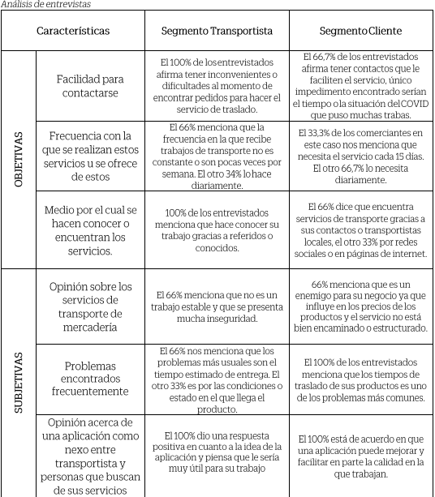

# 

Capítulo II: Requirements Elicitation & Analysis

## Competidores

Competitive Analysis Landscape

### Estrategias y tacticas frente a competidores

**Liderazgo en costes**

Las personas buscan precios comodos, por esta razon nuestra plataforma permite visualizar las mejores ofertas deacuerdo a su presupuesto.

**Estrategias de diferenciacion**

Nuestra aplicacion ofrece una idea innovadora de ofrecer diversos servicios de movilidad haciendo que tengamos un amplio catalogo de servicios.

**Estrategia de enfoque**

Actualmente las personas utilizan mucho la tecnologia para poder ofrecer informacion sobre algo que les interese. Por esta razon, se decidio crear una apliacion para que en una sola plataforma puedan obtener todos los servicios de movilidad que las personas necesiten.

**Tactica de expansion**

Si la aplicacion logra tener mucho exito, se planea ofrecer un servicio directo de la empresa a los clientes , dando un servicio mas seguro y confiable.

## Entrevistas

### Diseño de entrevistas

Preguntas al segmento cliente:

- ¿Cual es tu nombre, que edad tienes y a que te dedicas?

- ¿Que opinas de los servicios de transporte de mercaderia en el Peru?

- ¿Alguna vez contactaste con un servicio de traslado de productos? ¿Por que medio obtuviste el contacto?

- ¿Que tan complicado se te hace encontrar de traslado de productos?

- ¿Que tan complicado se te hace encontrar un servicio de traslado de productos?

- ¿Que tan importante consideras el estar pendiente de la ubicacion de tu producto en tiempo real?

- ¿A quien recurres cuando necesitas el servicio de traslado de tus productos?

- ¿Que tan importante consideras el estar pendiente de la ubicacion de tu producto en tiempo real?

- ¿Considera importante conocer el modelo y el año del vehiculo que va a trasladar su producto?

- ¿Que opina acerca de una aplicacion que te facilite encontrar un servicio de traslado de productos?

- ¿Estaria dispuesto a probarla? ¿Por que?

- ¿Que cree que  podria mejorar o añadir a nuestra propuesta?

### Registro de entrevistas

### Analisis de entrevistas

## Needfinding

### User Personas

User Persona Manuel Segura, usuario cliente

User Persona Mario Gomez, usuario transportista

### User Task Matrix

User Task Matrix del usuario cliente

| Tareas                                                        | Frecuencia    | Importancia |
| ------------------------------------------------------------- | ------------- | ----------- |
| Contactar con un transportistas para hacer uso de transporte  | Siempre       | Alta        |
| Saber cual sera el precio por el transporte                   | Siempre       | Alta        |
| Conocer los tipos de transporte que ofrecer el transportista  | Siempre       | Alta        |
| Hacer un seguimiento del producto                             | Casi siempre  | Alta        |
| Mostrar los transportistas para brindarle opciones al usuario | Casi siempre  | Media       |
| Brindar una reseña del servicio                               | Algunas veces | Media       |
| Recomendar el servicio proporcionado                          | Casi nunca    | Baja        |
| Contactar con el cliente                                      | A menudo      | Alta        |
| Acordar cual sera el producto por llevar  y el tamaño         | A menudo      | Alta        |
| Acordar el precio con el cliente                              | Siempre       | Alta        |
| Establecer el dia de llegada del producto                     | Siempre       | Alta        |
| Pactar cual sera el lugar de destino                          | Siempre       | Alta        |
| Transportar el producto                                       | Siempre       | Alta        |
| Evidenciar que el producto ha sido entregado con exito        | A menudo      | Media       |
| Cobrar por el servicio                                        | Siempre       | Alta        |

### User Journey Mapping

[Customer journey map Cliente.png - Google Drive](https://drive.google.com/file/d/1DelRJHx-PkUYMqBJS3kn_UyRooJebH82/view?usp=sharing)

User Journey Mapping del usuario Cliente

[Customer journey map Transportista.png - Google Drive](https://drive.google.com/file/d/195237stsxd5KRQodgBIrRZVIegOIYVhi/view?usp=sharing)

User Journey Mapping del usuario transportista

### Empathy Mapping

Empathy Mapping del usuario cliente

Empathy Mapping del usuario transportistas

### As-is Scenario Mapping

As-is Scenario Mapping del usuario cliente

As-is Scenario Mapping del usuario transportistas

